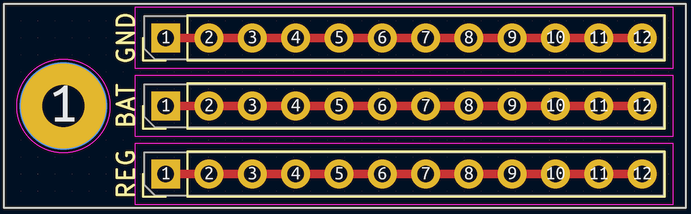
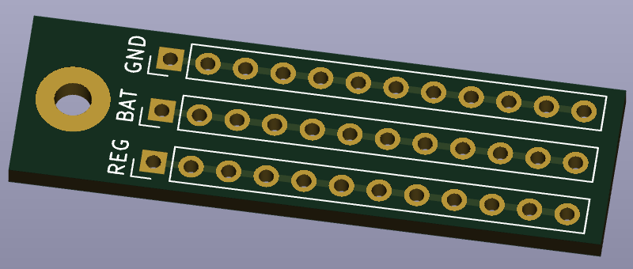
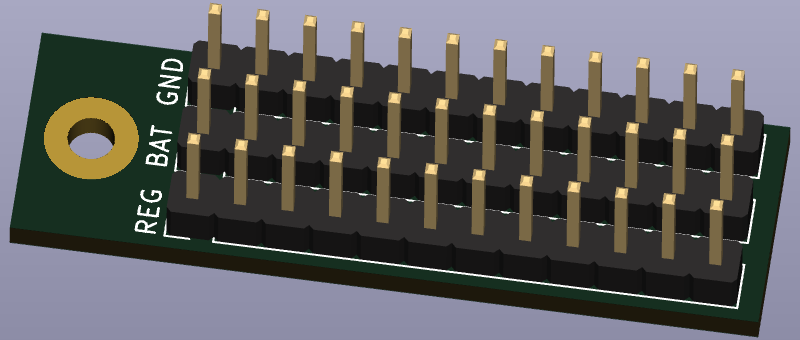
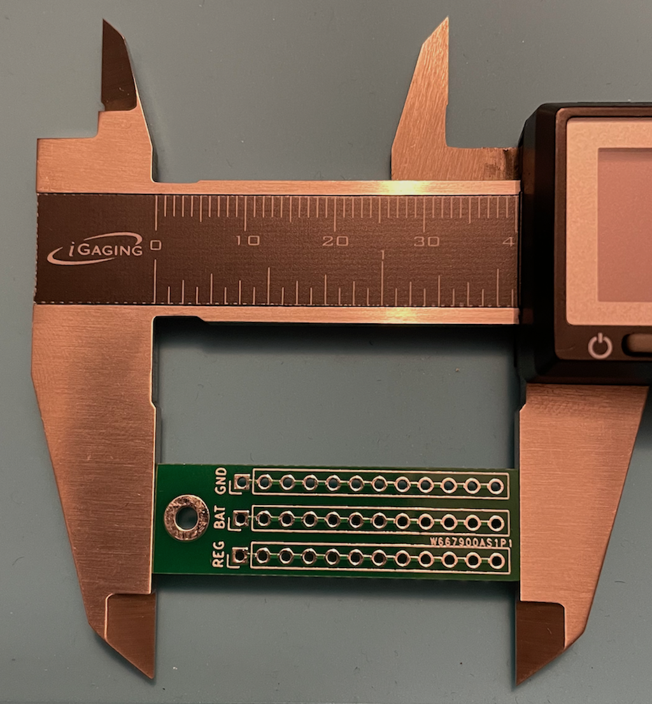

# Why?

When electronics projects need power distribution to more than a few components, we typically need to splice wires. It takes extra time, materials, space, and my results look like a rat's nest. I wanted a way to quickly distribute power to a bunch of components without having to splice wires.

# How?

A PCB that distributes power would be enough to clean up my piles of spliced spaghetti. I could solder wires to it like any other PCB in seconds without splicing, heat shrink tubing, and cursing.

# What?

Proto Power Rails has 3 power lines, and I primarily use them to distribute ground, battery, and regulator.

Features:
- Each rail supports 12 pins/wires.
- The pins are spaced 2.54mm apart so that headers can be soldered onto the board.
- A common ground rail will help to prevent ground loops.
- A battery rail for amplifiers, LEDs, and other components that draw more current than a microcontroller regulator can provide.
- A regulator rail for components with low current draw. The microcontroller can often manage this regulator to save power and allow charging while the main features of the device are off.
- A single 2.5mm mounting hole so that an M2 screw can hold it in place.
- Dimensions: 40mm x 12mm

# Details

This was my first attempt at making a PCB and also first experience with [KiCad](https://www.kicad.org/). It was a bit of a steep learning curve, and I was pleasantly surprised when [PCBWay](https://www.pcbway.com/) delivered a stack of boards that passed continuity tests for each rail.

All required files for PCBWay are [bundled into a zip file](proto-power-rails.kicad_pcb.zip).

## PCB Design

## 3D Models

## Final Result

